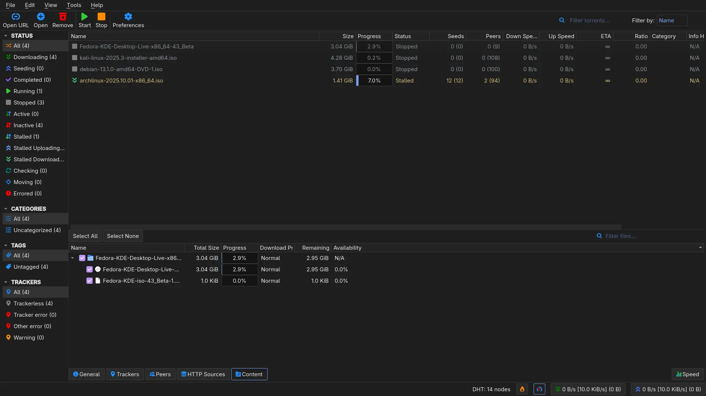
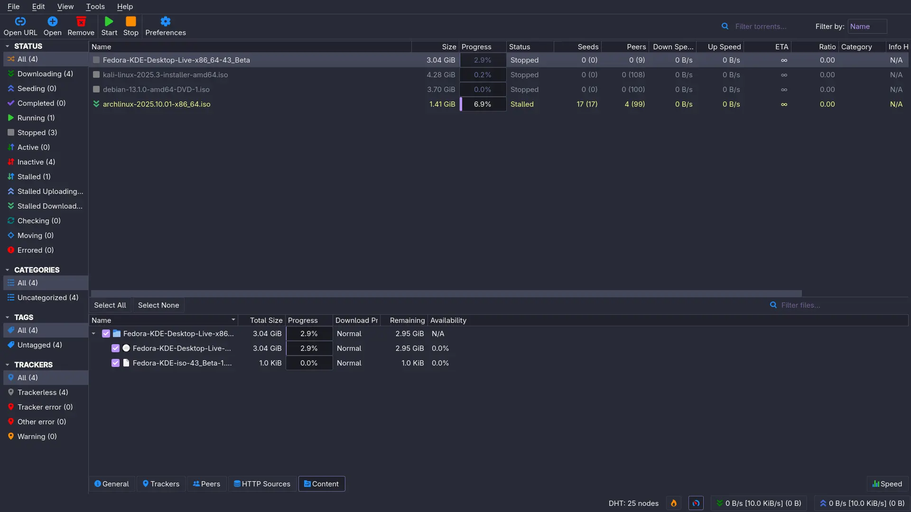
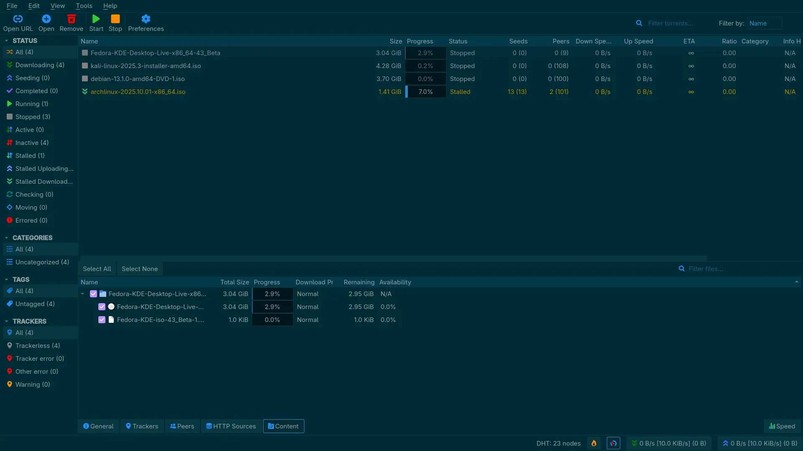
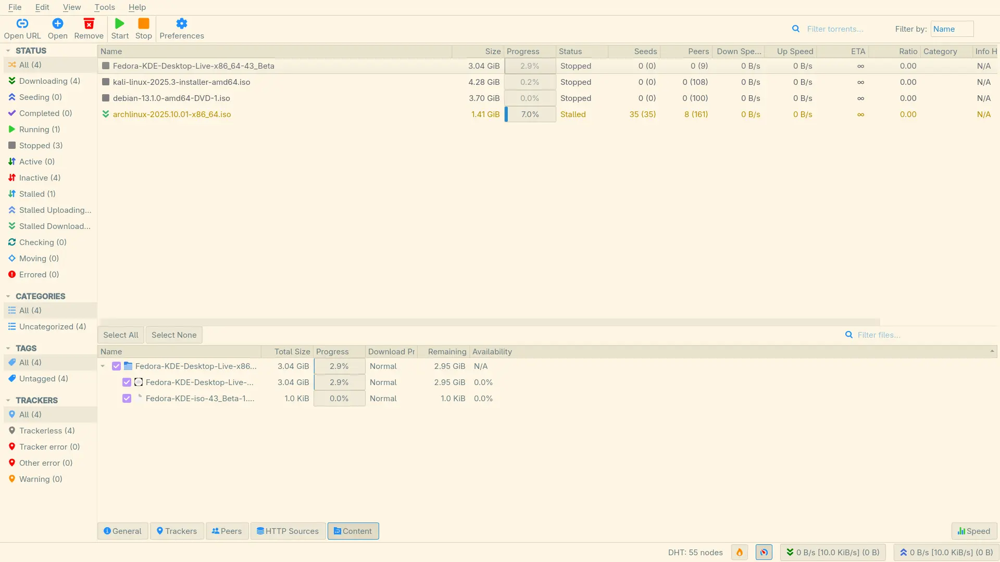
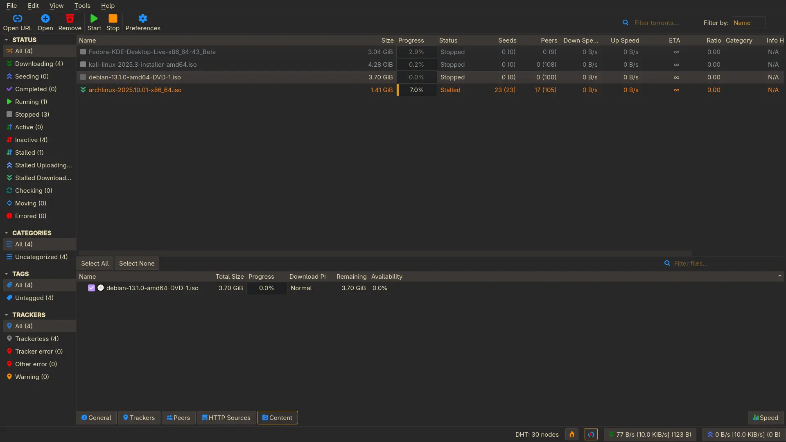
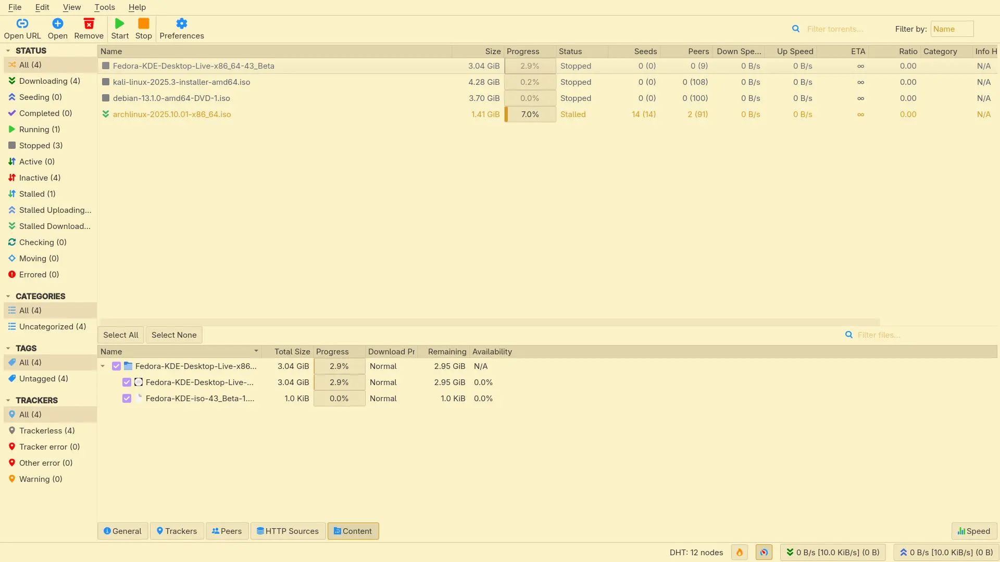

# qBittorrent Themes (Qt client + WebUI)

Curated themes for qBittorrent. Each theme ships in two formats:
- Qt desktop client: .qbtheme
- WebUI (incl. qbittorrent-nox): tar.gz or zip archive

## Downloads

### WebUI themes
- Dark: [tar.gz](https://github.com/MahdiMirzadeh/qbittorrent/releases/latest/download/dark.tar.gz) · [zip](https://github.com/MahdiMirzadeh/qbittorrent/releases/latest/download/dark.zip)
- Dracula: [tar.gz](https://github.com/MahdiMirzadeh/qbittorrent/releases/latest/download/dracula.tar.gz) · [zip](https://github.com/MahdiMirzadeh/qbittorrent/releases/latest/download/dracula.zip)
- Solarized Dark: [tar.gz](https://github.com/MahdiMirzadeh/qbittorrent/releases/latest/download/solarized-dark.tar.gz) · [zip](https://github.com/MahdiMirzadeh/qbittorrent/releases/latest/download/solarized-dark.zip)
- Solarized Light: [tar.gz](https://github.com/MahdiMirzadeh/qbittorrent/releases/latest/download/solarized-light.tar.gz) · [zip](https://github.com/MahdiMirzadeh/qbittorrent/releases/latest/download/solarized-light.zip)
- Gruvbox Dark: [tar.gz](https://github.com/MahdiMirzadeh/qbittorrent/releases/latest/download/gruvbox-dark.tar.gz) · [zip](https://github.com/MahdiMirzadeh/qbittorrent/releases/latest/download/gruvbox-dark.zip)
- Gruvbox Light: [tar.gz](https://github.com/MahdiMirzadeh/qbittorrent/releases/latest/download/gruvbox-light.tar.gz) · [zip](https://github.com/MahdiMirzadeh/qbittorrent/releases/latest/download/gruvbox-light.zip)

### Qt client themes (.qbtheme)
- Dark: https://github.com/MahdiMirzadeh/qbittorrent/releases/latest/download/dark.qbtheme
- Dracula: https://github.com/MahdiMirzadeh/qbittorrent/releases/latest/download/dracula.qbtheme
- Solarized Dark: https://github.com/MahdiMirzadeh/qbittorrent/releases/latest/download/solarized-dark.qbtheme
- Solarized Light: https://github.com/MahdiMirzadeh/qbittorrent/releases/latest/download/solarized-light.qbtheme
- Gruvbox Dark: https://github.com/MahdiMirzadeh/qbittorrent/releases/latest/download/gruvbox-dark.qbtheme
- Gruvbox Light: https://github.com/MahdiMirzadeh/qbittorrent/releases/latest/download/gruvbox-light.qbtheme

## Install

### WebUI (Alternative Web UI)
1) Download a WebUI archive (tar.gz or zip) from above and extract it to a folder, e.g. /opt/qbt-webui/dracula
2) In qBittorrent: Tools → Options → Web UI → check “Use alternative Web UI” → set Files location to that folder → Save
3) Reload the page. If you get “Unacceptable file type, only regular file is allowed”, disable the alternative UI via:
   /api/v2/app/setPreferences?json=%7B%22alternative_webui_enabled%22:false%7D

### Qt desktop (.qbtheme)
Tools → Options → Behavior → Interface theme → choose the .qbtheme file → OK → restart qBittorrent

## Build locally
Requirements: jq, Qt rcc (Qt5/Qt6).
- Build all themes: ./gen.sh
- Single theme: ./gen.sh themes/dracula.json
Outputs:
- qt/<theme>.qbtheme
- webui/<theme>.tar.gz (and .zip if zip is available)

## Screenshots

### Qt client
- Dark
  
  
- Dracula
  
  
- Solarized Dark
  
  
- Solarized Light
  
  
- Gruvbox Dark
  
  
- Gruvbox Light
  
  

### WebUI
- (coming soon)

## Notes
- Themes are compatible with qBittorrent 4.6.0+ (Qt6). Older Qt5 builds generally work but visuals may differ slightly.
- WebUI archives contain a theme.css override layered on top of the stock WebUI.

License: see LICENSE. Credits to the qBittorrent project.
