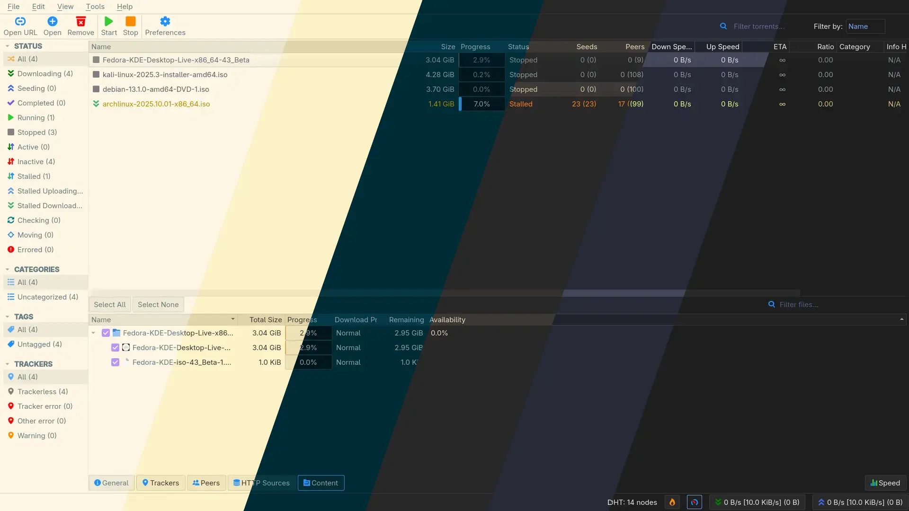
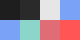
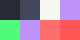

<h1 align="center">
	Themes for <a href="https://github.com/qbittorrent/qBittorrent">qBittorrent</a>
</h1>

<p align="center">
	
</p>

> Left-to-right: solarized-light, gruvbox-light, solarized-dark, gruvbox-dark, dracula, dark

Curated color themes for **qBittorrent**, available for both the Qt desktop client and WebUI (qbittorrent-nox). Each theme ships in two formats:

- **Qt desktop client**: `.qbtheme` bundle (v4.6.0+, Qt6)
- **WebUI**: `.tar.gz` or `.zip` archive

## 📦 Downloads

| Theme | Palette | Qt Client | WebUI |
|-------|---------|-----------|-------|
| **Dark** |  | [.qbtheme](https://github.com/MahdiMirzadeh/qbittorrent/releases/latest/download/dark.qbtheme) | [tar.gz](https://github.com/MahdiMirzadeh/qbittorrent/releases/latest/download/webui-dark.tar.gz) · [zip](https://github.com/MahdiMirzadeh/qbittorrent/releases/latest/download/webui-dark.zip) |
| **Dracula** |  | [.qbtheme](https://github.com/MahdiMirzadeh/qbittorrent/releases/latest/download/dracula.qbtheme) | [tar.gz](https://github.com/MahdiMirzadeh/qbittorrent/releases/latest/download/webui-dracula.tar.gz) · [zip](https://github.com/MahdiMirzadeh/qbittorrent/releases/latest/download/webui-dracula.zip) |
| **Gruvbox Dark** |  | [.qbtheme](https://github.com/MahdiMirzadeh/qbittorrent/releases/latest/download/gruvbox-dark.qbtheme) | [tar.gz](https://github.com/MahdiMirzadeh/qbittorrent/releases/latest/download/webui-gruvbox-dark.tar.gz) · [zip](https://github.com/MahdiMirzadeh/qbittorrent/releases/latest/download/webui-gruvbox-dark.zip) |
| **Solarized Dark** |  | [.qbtheme](https://github.com/MahdiMirzadeh/qbittorrent/releases/latest/download/solarized-dark.qbtheme) | [tar.gz](https://github.com/MahdiMirzadeh/qbittorrent/releases/latest/download/webui-solarized-dark.tar.gz) · [zip](https://github.com/MahdiMirzadeh/qbittorrent/releases/latest/download/webui-solarized-dark.zip) |
| **Gruvbox Light** |  | [.qbtheme](https://github.com/MahdiMirzadeh/qbittorrent/releases/latest/download/gruvbox-light.qbtheme) | [tar.gz](https://github.com/MahdiMirzadeh/qbittorrent/releases/latest/download/webui-gruvbox-light.tar.gz) · [zip](https://github.com/MahdiMirzadeh/qbittorrent/releases/latest/download/webui-gruvbox-light.zip) |
| **Solarized Light** |  | [.qbtheme](https://github.com/MahdiMirzadeh/qbittorrent/releases/latest/download/solarized-light.qbtheme) | [tar.gz](https://github.com/MahdiMirzadeh/qbittorrent/releases/latest/download/webui-solarized-light.tar.gz) · [zip](https://github.com/MahdiMirzadeh/qbittorrent/releases/latest/download/webui-solarized-light.zip) |

## 🚀 Installation

### WebUI (Alternative Web UI)

1. Download a WebUI theme archive (`.tar.gz` or `.zip`) from the [Downloads](#-downloads) section
2. Extract it to a directory:
   ```bash
   mkdir -p ~/.config/qbittorrent/webui
   tar -xzf webui-dracula.tar.gz -C ~/.config/qbittorrent/webui
   ```
3. In qBittorrent:
   - Go to **Tools → Options → Web UI**
   - Enable **"Use alternative Web UI"**
   - Set **"Files location"** to the extracted folder (e.g., `~/.config/qbittorrent/webui/webui-dracula`)
   - Click **Save** and reload the WebUI page

**Troubleshooting**: If you encounter "Unacceptable file type, only regular file is allowed", disable alternative UI via API:
```bash
curl "http://localhost:8080/api/v2/app/setPreferences?json=%7B%22alternative_webui_enabled%22:false%7D"
```

### Qt Desktop Client

1. Download a `.qbtheme` file from the [Downloads](#-downloads) section
2. In qBittorrent:
   - Go to **Tools → Options → Behavior → Interface**
   - Under **"Interface theme"**, click **"..."** and select the downloaded `.qbtheme` file
   - Click **OK** and **restart qBittorrent**

## 🛠️ Build Locally

### Prerequisites

- `jq` — JSON processor
- `rcc` — Qt Resource Compiler (Qt5 or Qt6)
- `zip` — (optional) for WebUI `.zip` archives

```bash
# Arch Linux
sudo pacman -S jq qt6-base

# Ubuntu/Debian
sudo apt install jq qtbase5-dev-tools

# macOS
brew install jq qt
```

### Build Commands

```bash
# Build all themes
./gen.sh

# Build a single theme
./gen.sh themes/dracula.json

# Outputs:
# - qt/<theme>.qbtheme
# - webui/<theme>.tar.gz
# - webui/<theme>.zip (if zip is installed)
```

## 📸 Screenshots

### Qt client
- Dark


- Dracula


- Gruvbox Dark


- Solarized Dark


- Gruvbox Light


- Solarized Light


### WebUI
- (coming soon)

## 🧑‍💻 Development

### Architecture

This repository contains:

```
.
├── gen.sh              # POSIX-compliant build script
├── themes/             # Theme definitions (JSON)
│   ├── dracula.json
│   ├── dark.json
│   └── ...
├── template/
│   ├── qt/             # Qt client templates
│   │   ├── stylesheet.qss.template
│   │   ├── config.json.template
│   │   └── icons/
│   └── webui/          # WebUI base + theme override
│       ├── private/
│       │   └── css/
│       │       └── theme.css.template
│       └── ...
├── qt/                 # Build output: .qbtheme files
└── webui/              # Build output: archives
```

### Qt Client Themes

#### Overview

qBittorrent themes (supported since **v4.2.2**) are `.qbtheme` bundles — Qt Resource Collection (RCC) files loaded at runtime. These bundles use the virtual path `:/uitheme` for all resources.

#### File Structure

A `.qbtheme` file must contain:

- **`stylesheet.qss`** (required) — Qt Style Sheet defining widget appearance
- **`config.json`** (required, since **v4.3.0**) — Color definitions for GUI elements
- **`icons/`** (optional, since **v4.3.0**) — Custom icon overrides

#### `stylesheet.qss` — Qt Style Sheets

Uses CSS-like syntax to style Qt widgets. Resources are referenced via `:/uitheme` prefix:

```css
QPushButton {
    background: #282a36;
    border: 1px solid #44475a;
}

QCheckBox::indicator:checked {
    image: url(:/uitheme/icons/checkbox_checked.svg);
}
```

**References**:
- [Qt Style Sheets Reference](https://doc.qt.io/qt-6/stylesheet-reference.html)
- [Qt Style Sheets Examples](https://doc.qt.io/qt-6/stylesheet-examples.html)

#### `config.json` — Color Definitions

Defines semantic colors used throughout qBittorrent's GUI. Accepts `#rrggbb` hex or [Qt color names](https://doc.qt.io/qt-6/qml-color.html#svg-color-reference).

**Supported color keys**:

```json
{
  "colors": {
    // Palette roles (Qt standard)
    "Palette.Window": "#282a36",
    "Palette.WindowText": "#f8f8f2",
    "Palette.Base": "#1e1f29",
    "Palette.AlternateBase": "#282a36",
    "Palette.Text": "#f8f8f2",
    "Palette.Button": "#44475a",
    "Palette.ButtonText": "#f8f8f2",
    "Palette.BrightText": "#ffffff",
    "Palette.Highlight": "#bd93f9",
    "Palette.HighlightedText": "#ffffff",
    "Palette.Link": "#8be9fd",
    "Palette.Light": "#6272a4",
    "Palette.Midlight": "#44475a",
    "Palette.Mid": "#383a59",
    "Palette.Dark": "#191a21",
    
    // Log colors
    "Log.TimeStamp": "#6272a4",
    "Log.Normal": "#f8f8f2",
    "Log.Info": "#8be9fd",
    "Log.Warning": "#ffb86c",
    "Log.Critical": "#ff5555",
    "Log.BannedPeer": "#ff79c6",
    
    // Transfer list state colors
    "TransferList.Downloading": "#50fa7b",
    "TransferList.StalledDownloading": "#f1fa8c",
    "TransferList.Uploading": "#bd93f9",
    "TransferList.StalledUploading": "#ffb86c",
    "TransferList.PausedDownloading": "#ff6e6e",
    "TransferList.PausedUploading": "#ff79c6",
    "TransferList.Error": "#ff5555",
    "TransferList.MissingFiles": "#ff5555"
  }
}
```

#### Custom Icons

Override default icons by including files matching [qBittorrent's icon names](https://github.com/qbittorrent/qBittorrent/tree/master/src/icons) in your theme:

```
icons/
├── application-exit.svg
├── edit-clear.svg
├── folder-new.svg
└── ...
```

Reference in QSS as: `url(:/uitheme/icons/your_icon.svg)`

#### Our Build Process

1. Reads color tokens from `themes/<name>.json`
2. Substitutes placeholders in `stylesheet.qss.template` and `config.json.template`
3. Compiles with Qt's `rcc` tool → `qt/<name>.qbtheme`

#### Version Compatibility

- **qBittorrent v4.6.0+** (Qt6) — Fully supported
- **qBittorrent v4.3.0–4.5.x** (Qt5) — Compatible with `config.json` colors
- **qBittorrent v4.2.2–4.2.5** — QSS only (no `config.json`)

**Official Documentation**: [Create custom themes for qBittorrent](https://github.com/qbittorrent/qBittorrent/wiki/Create-custom-themes-for-qBittorrent)

### WebUI Themes

#### Overview

qBittorrent's WebUI (since **v4.1.0**) supports alternate WebUI implementations through external file directories. The architecture separates:

- **`public/`** — Login/authentication pages
- **`private/`** — Main WebUI functionality (requires authentication)

This separation enhances security and allows customization without modifying qBittorrent itself.

#### File Structure

An alternate WebUI must replicate qBittorrent's [stock WebUI structure](https://github.com/qbittorrent/qBittorrent/tree/master/src/webui/www):

```
webui-mytheme/
├── public/
│   ├── index.html          # Login page
│   ├── login.html
│   └── images/             # Icons for login
├── private/
│   ├── index.html          # Main WebUI
│   ├── css/
│   │   ├── style.css
│   │   └── theme.css       # Our theme override
│   ├── scripts/
│   └── images/
├── translations/
└── webui.qrc
```

#### Our Theming Approach

Instead of creating a full alternate WebUI, we **extend the stock WebUI** with a `theme.css` overlay:

1. Copy the stock WebUI structure from `template/webui/`
2. Add `private/css/theme.css.template` with CSS variables:
   ```css
   :root {
       --bg-primary: %BG_PRIMARY%;
       --fg-primary: %FG_PRIMARY%;
       --accent: %ACCENT%;
       --status-downloading: %STATUS_DOWNLOADING%;
       /* ... */
   }
   
   /* Override stock styles */
   body { background: var(--bg-primary); color: var(--fg-primary); }
   .toolbar { background: var(--bg-secondary); }
   ```
3. Load `theme.css` **last** in `index.html` to ensure overrides take precedence
4. Render tokens from `themes/<name>.json` and pack as `.tar.gz`/`.zip`

#### Installation

Users extract the archive and configure qBittorrent:

1. **Tools → Options → Web UI**
2. Enable **"Use alternative Web UI"**
3. Set **"Files location"** to the extracted directory
4. Save and reload

**Note**: qbittorrent-nox requires **regular files** (no symlinks) due to security restrictions.

#### Customization

- **Colors**: Edit `theme.css.template` CSS variables
- **Icons**: Replace files in `public/images/` and `private/images/`
- **Layout**: Modify HTML/CSS in `private/` (advanced)

#### Build Process

Our `gen.sh` script:

1. Copies `template/webui/` to temp directory
2. Renders `theme.css` from `theme.css.template` using JSON color tokens
3. Creates archives: `webui/webui-<name>.tar.gz` (and `.zip`)

**Official Documentation**: [Developing alternate WebUIs](https://github.com/qbittorrent/qBittorrent/wiki/Developing-alternate-WebUIs-(WIP))

### Creating a New Theme

1. **Create a theme definition**:
   ```bash
   cp themes/dracula.json themes/mytheme.json
   ```

2. **Edit color tokens** in `themes/mytheme.json`:
   ```json
   {
     "name": "My Theme",
     "author": "Your Name",
     "description": "A beautiful custom theme",
     "colors": {
       "BG_PRIMARY": "#1e1e2e",
       "FG_PRIMARY": "#cdd6f4",
       "ACCENT": "#89b4fa",
       ...
     }
   }
   ```
   
   **Required tokens**: See existing themes for the full list of color keys.

3. **Build the theme**:
   ```bash
   ./gen.sh themes/mytheme.json
   ```

4. **Output artifacts**:
   - `qt/mytheme.qbtheme`
   - `webui/mytheme.tar.gz`
   - `webui/mytheme.zip` (if `zip` is installed)

## ⚙️ Compatibility

- **qBittorrent v4.6.0+** (Qt6) — Fully tested and supported
- **qBittorrent < v4.6.0** (Qt5) — Generally compatible, minor rendering differences may occur
- **WebUI** — Works with all qBittorrent versions supporting alternative WebUI

## 🤝 Contributing

Contributions are welcome! To add a new theme:

1. Fork this repository
2. Create a new theme JSON in `themes/`
3. Test locally with `./gen.sh`
4. Submit a pull request

For bug reports or feature requests, please [open an issue](https://github.com/MahdiMirzadeh/qbittorrent/issues).

## 📄 License

MIT License — see [LICENSE](LICENSE) for details.

Theme generator and templates by [Mahdi Mirzadeh](https://github.com/MahdiMirzadeh). Built for the [qBittorrent project](https://www.qbittorrent.org/).
